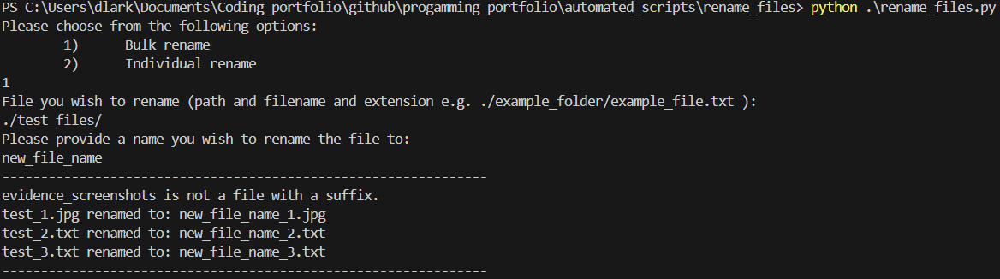
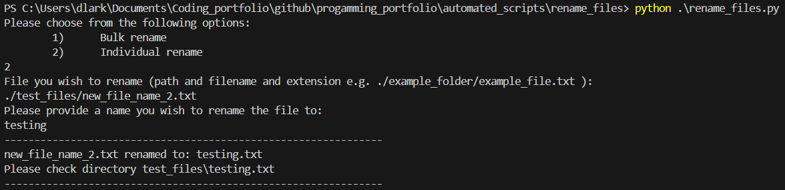

# Automated file rename script
Created the following script to quicken the process of renaming files.

# Run Commands
## Rename files in bulk via command line
This command is handy if you require to update files in bulk, minor updates can be made to the script to ensure that the new file names are as required.

E.g. if you needed to update the files to have dates within the filename
```bash
python rename_files.py b ./test_files/ new_file_name
```
or
```bash
python rename_files.py bulk ./test_files/ new_file_name
```
or
```bash
python rename_files.py B ./test_files/ new_file_name
```
or
```bash
python rename_files.py BULK ./test_files/ new_file_name
```
## Rename an individual file via command line
```bash
python rename_files.py ./test_files/old_file.suffix new_file_name
```
## Rename files using the scripts internal commands
```bash
python rename_files.py
```
### Bulk renames
```bash
Please choose from the following options:
        1)      Bulk rename
        2)      Individual rename
1
File you wish to rename (path and filename and extension e.g. ./example_folder/example_file.txt ):
./test_files/
Please provide a name you wish to rename the file to:
new_file_name
```


### individual file rename
```bash
Please choose from the following options:
        1)      Bulk rename
        2)      Individual rename
2
File you wish to rename (path and filename and extension e.g. ./example_folder/example_file.txt ):
./test_files/rew_1.txt
Please provide a name you wish to rename the file to:
new_file_name_2
```
