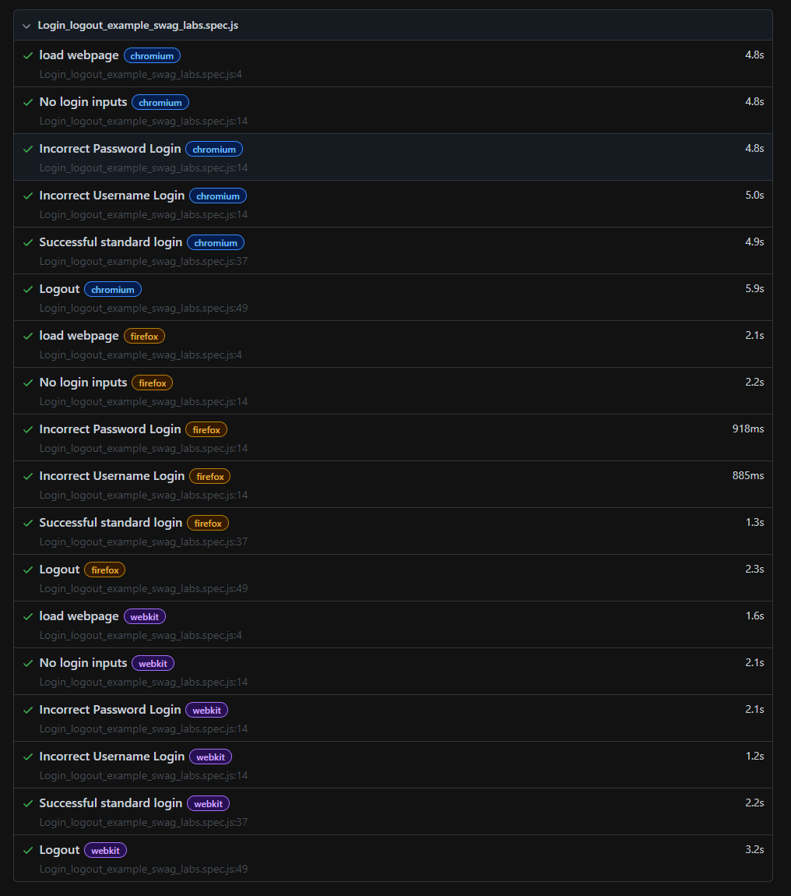

# Playwright
These test are based on the test cases I wrote in: 
<a href="quality_assurance/documentation/">Example_login_logout_testcases.xlsx </a>
quality_assurance/documentation/Example_login_logout_testcases.xlsx

### Install Playwright
```bash
npm init playwright@latest
```

## How to run playwright app
```bash
npx playwright test
```
### Show the report
```bash
npx playwright show-report
```
### Success report
 